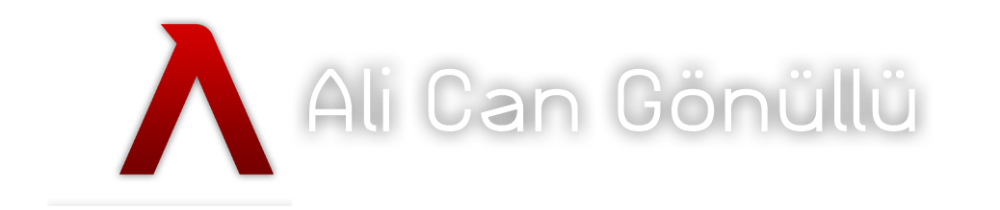
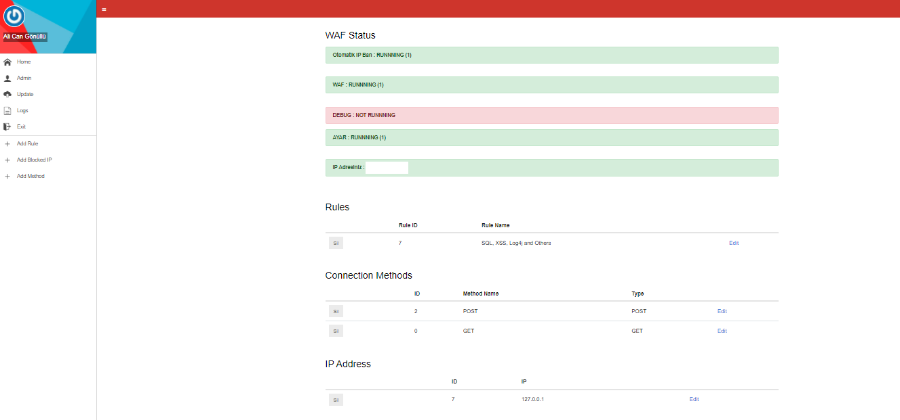

<h1>AliGuard PHP WAF</h1>

<h2>What is this ?</h2>
<b>AliWAF, basicly is a PHP WAF. You can protect your code from the attacks.</b> 
<h2>Features</h2>
<ul>
  <li> Firewall Blacklist </li>
  <li> IP and blacklist logging </li>
  <li> IP Ban </li>
  <li> Debug Mode </li>
  <li> Connection Method (GET, POST, PUT, OPTION etc.) Ban Mode </li>
  <li> GET/POST Request Checker </li>
  <li> Admin GUI </li>
</ul>
<h2>How to install ?</h2>
<b>You must add this code on your code.</b>
 
<pre>require_once("engelle.php");</pre>
 
<pre>default user/pass : admin/19742008</pre>
 
<h2>Pictures</h2>

