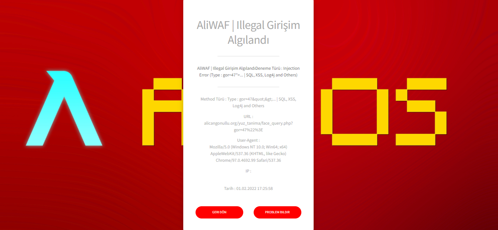
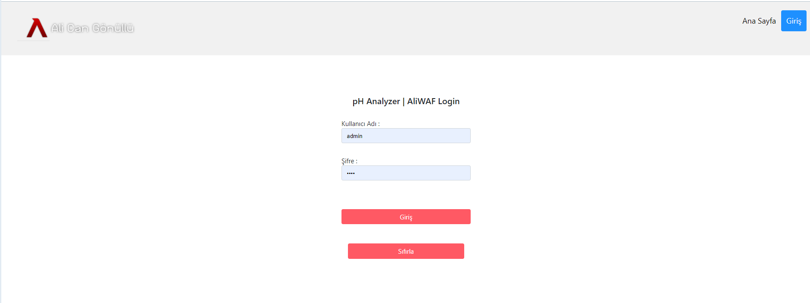
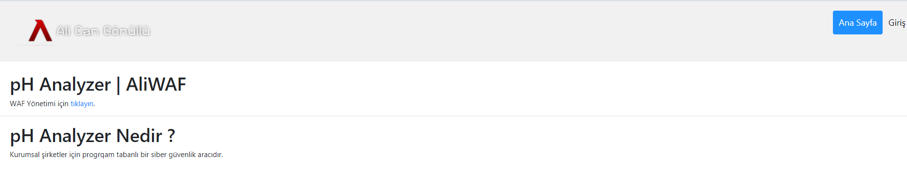
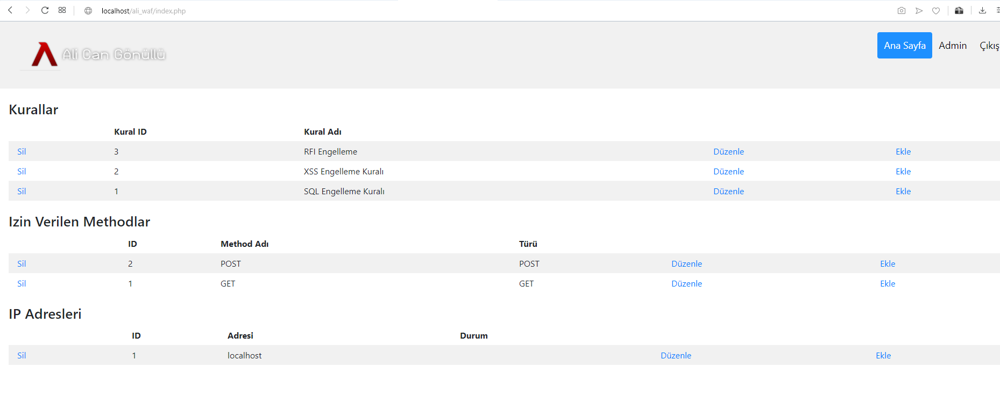

<h1>Log4j Detector can be add!</h1>

    <article class="markdown-body entry-content p-3 p-md-6" itemprop="text"><h1><a id="user-content-aliguard-phpwaf" class="anchor" aria-hidden="true" href="#aliguard-phpwaf"><svg class="octicon octicon-link" viewBox="0 0 16 16" version="1.1" width="16" height="16" aria-hidden="true"><path fill-rule="evenodd" d="M4 9h1v1H4c-1.5 0-3-1.69-3-3.5S2.55 3 4 3h4c1.45 0 3 1.69 3 3.5 0 1.41-.91 2.72-2 3.25V8.59c.58-.45 1-1.27 1-2.09C10 5.22 8.98 4 8 4H4c-.98 0-2 1.22-2 2.5S3 9 4 9zm9-3h-1v1h1c1 0 2 1.22 2 2.5S13.98 12 13 12H9c-.98 0-2-1.22-2-2.5 0-.83.42-1.64 1-2.09V6.25c-1.09.53-2 1.84-2 3.25C6 11.31 7.55 13 9 13h4c1.45 0 3-1.69 3-3.5S14.5 6 13 6z"></path></svg></a><h1>pH Analyzer | AliWAF</h1>
 
<b> Bug Notify : <a href="mailto:alicangonullu@yahoo.com">alicangonullu@yahoo.com</a></b>  
<pre>
 Bug Name : xxx
 Bug Code : xxx
 Bug File : xxx.php
 Bug Fix Methods : xxx

We will add bug hunter list for this project.
</pre>

 Kodlardaki açıkları bulmaktan sıkıldınız mı ?

 AliWAF sizin yerinize denetlesin :)

 AliWAF SQL tabanlı çalışan bir programdır.

 SQL veritabanına eklediğiniz kuralları sitenizde engeller. Böylece sayfalarca kodu incelemek yerine tek bir adımda açıkları kapatabilirsiniz.

<code>
  <h3><a id="user-content--yeni-güncelleme" class="anchor" aria-hidden="true" href="#-yeni-güncelleme"><svg class="octicon octicon-link" viewBox="0 0 16 16" version="1.1" width="16" height="16" aria-hidden="true"><path fill-rule="evenodd" d="M4 9h1v1H4c-1.5 0-3-1.69-3-3.5S2.55 3 4 3h4c1.45 0 3 1.69 3 3.5 0 1.41-.91 2.72-2 3.25V8.59c.58-.45 1-1.27 1-2.09C10 5.22 8.98 4 8 4H4c-.98 0-2 1.22-2 2.5S3 9 4 9zm9-3h-1v1h1c1 0 2 1.22 2 2.5S13.98 12 13 12H9c-.98 0-2-1.22-2-2.5 0-.83.42-1.64 1-2.09V6.25c-1.09.53-2 1.84-2 3.25C6 11.31 7.55 13 9 13h4c1.45 0 3-1.69 3-3.5S14.5 6 13 6z"></path></svg></a> Yeni Güncelleme!</h3>
  
 - Translated English! 

  
 - IP Ban Özelliği Geldi (IP Ban Function) 

  
 - Tema Eklendi (Theme Added)

  
 - Istek Methodu(GET,POST etc.) Whitelist Eklendi (Request Method Whitelist)

  
 - DDoS (Snowloris) Block (Soon...)

  
 - <a href="https://www.php.net/manual/tr/ini.core.php">Bellek Limiti</a> Eklendi

  </code>
<h3><a id="user-content--nasıl-çalışır-" class="anchor" aria-hidden="true" href="#-nasıl-çalışır-"><svg class="octicon octicon-link" viewBox="0 0 16 16" version="1.1" width="16" height="16" aria-hidden="true"><path fill-rule="evenodd" d="M4 9h1v1H4c-1.5 0-3-1.69-3-3.5S2.55 3 4 3h4c1.45 0 3 1.69 3 3.5 0 1.41-.91 2.72-2 3.25V8.59c.58-.45 1-1.27 1-2.09C10 5.22 8.98 4 8 4H4c-.98 0-2 1.22-2 2.5S3 9 4 9zm9-3h-1v1h1c1 0 2 1.22 2 2.5S13.98 12 13 12H9c-.98 0-2-1.22-2-2.5 0-.83.42-1.64 1-2.09V6.25c-1.09.53-2 1.84-2 3.25C6 11.31 7.55 13 9 13h4c1.45 0 3-1.69 3-3.5S14.5 6 13 6z"></path></svg></a> Nasıl Çalışır </h3>

 Şimdilik link tabanlı çalışıyor.

 Ancak gelecek güncellemede GET,POST,PUT vb. methodları da denetleyebilecek.

         

         

         

<code>
<pre>PHP Dosyanıza
require_once(“engelle.php”);
Şeklinde ekleyiniz.
</pre>
    <pre>
# Login teması alıntıdır #
# Default user/pass : admin/19742008 #
</pre>
</code></article>
  
 
<pre>
Bug Hunters (Founded thanks to)

<b>Henüz bug bulan yok / Here is empty right now</b>
</pre>

## License

